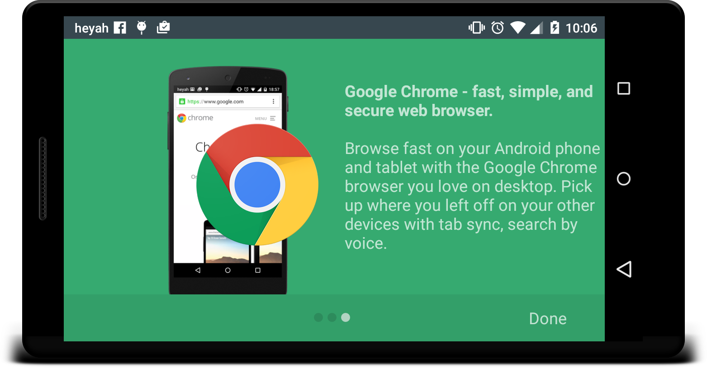

# Tutorial ViewPager []

Demo application using ViewPager and sweet smooth background changing color. The layouts are not optimized for different screen sizes.
The demos was inspired by Google Drive application and Google Calendar.

Google Play Store: https://play.google.com/store/apps/details?id=pl.solaris.tutorialviewpager

## Landscape
<iframe width="560" height="315" src="https://www.youtube.com/embed/46pm21kYtdU" frameborder="0" allowfullscreen></iframe>

## Portrait
<iframe width="420" height="315" src="https://www.youtube.com/embed/s6DiQR6LnMU" frameborder="0" allowfullscreen></iframe>

License
===========================
Apache License 2.0